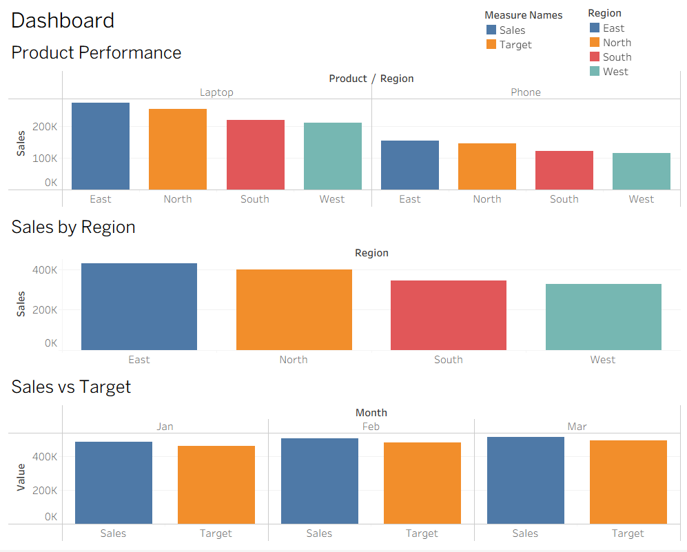

# Tableau Sales Dashboard

## Project Overview

Interactive business intelligence dashboard built in Tableau Public to analyse sales performance across regions, products, and monthly trends.

## Business Problem

Management requires a dashboard to monitor sales performance, compare products, evaluate regional performance, and track progress against sales targets.

---

## Tools & Skills

- Tableau Public
- Dashboard Design
- Data Visualization
- Business Analysis
- KPI Monitoring
- Interactive Filters
- Sales Analytics

---

## Dashboard Components

### KPI Monitoring
- Total Sales
- Total Units Sold
- Target Achievement %

### Regional Analysis
- Sales by Region

### Trend Analysis
- Monthly Sales Trend

### Product Analysis
- Product Performance by Region

### Target Performance
- Actual Sales vs Target

---

## Key Business Insights

- East region generated the highest sales revenue.
- Laptop sales contributed the largest share of revenue.
- Sales performance exceeded targets in multiple months.
- Regional sales performance varied significantly across the business.

---

## Screenshots

### Dashboard Overview

## Author

Kabilan Ramachandran

LinkedIn:
www.linkedin.com/in/kabilan-ramachandran

GitHub:
github.com/kabilanramachandran
